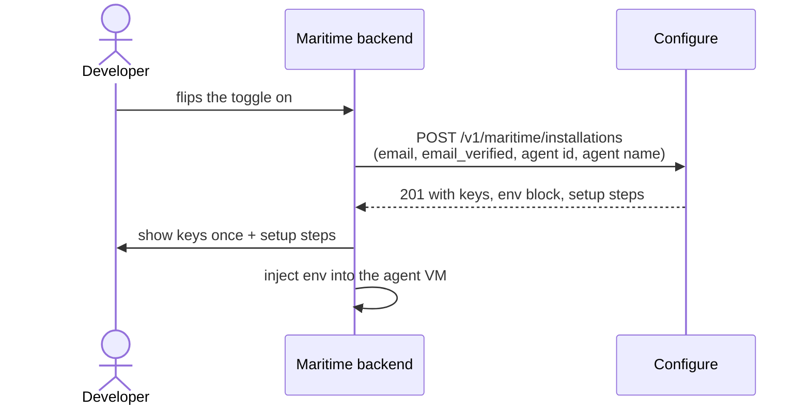
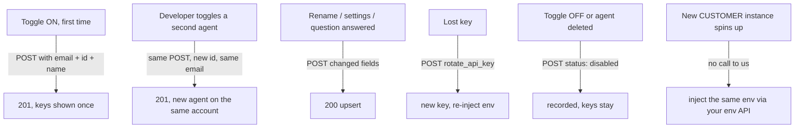

# Configure on Maritime

One endpoint. One synchronous POST. The keys come back in the response to that same call.

```
POST https://api.configure.dev/v1/maritime/installations
Authorization: Bearer <your partner key>
```

This doc covers the calls only. The toggle UI is yours, and we stay out of it. In your UI, a developer turns on personalization for an agent. Your backend makes one POST to us. We pass everything back.

## The flow



No callbacks. No webhooks. No polling. We never call you.

## The call

```bash
curl -s -X POST https://api.configure.dev/v1/maritime/installations \
  -H "Authorization: Bearer $CONFIGURE_PARTNER_KEY" \
  -H "Content-Type: application/json" \
  -d '{
    "maritime_agent_id": "<stable base agent or project id>",
    "email": "dev@example.com",
    "email_verified": true,
    "agent_name": "support-bot"
  }'
```

First call answers 201:

```jsonc
{
  "ok": true,
  "created": true,
  "account_existed": false,     // true means this email already had a Configure account and we attached to it
  "agent": "support-bot",
  "secret_key": "sk_…",         // shown ONCE, stored hashed on our side, never re-shown
  "publishable_key": "pk_…",
  "env": {                       // paste-ready, inject into the agent VM
    "CONFIGURE_AGENT": "support-bot",
    "CONFIGURE_API_KEY": "sk_…",
    "CONFIGURE_PUBLISHABLE_KEY": "pk_…"
  },
  "sign_in_url": "https://sign-in.me/support-bot",
  "claim_url": "https://configure.dev/login",
  "setup_steps": ["…"]           // render these under the keys
}
```

Calling again with the same `maritime_agent_id` is always safe: you get a 200 with `created: false` and no secret. Lost key? Send `"rotate_api_key": true` and the new key is in that response, with the old one already revoked. Re-inject env in the same flow.

For page loads, `GET /v1/maritime/installations/current?maritime_agent_id=…` returns the state and never returns keys. A 404 means the toggle is off.

## Fields

| Field | When | Why |
|---|---|---|
| `maritime_agent_id` | always | The stable base agent or project id. This is the idempotency key, so it must survive customer scaling. Never a per-customer instance id. |
| `email` | first call | Owner of the Configure account. If the email already has one, we attach the new agent and keys to it. Never a 409. |
| `email_verified` | with email | Must be `true`, and only when the email came from a verified login on your side. We refuse account work without it. |
| `agent_name` | recommended | The agent's name in your product. We derive the Configure handle from it. |
| `kind` | optional | `"personal"` or `"product"`. The answer to your provisioning question. Can arrive on any later call and switches the `setup_steps` wording. |
| `status` | optional | `"disabled"` on toggle off, `"active"` to re-enable. Bookkeeping only, keys are never revoked by toggle state. |
| `rotate_api_key` | optional | Mints a replacement secret key and revokes the old one atomically. |

The body is strict. A typo'd field name is a 400, not silently ignored.

## When to call us



Two things worth repeating:

- **Provision per base agent, never per customer instance.** Instances share the base agent's keys. Since your template snapshots blank secret values, injecting env into each new instance is your job.
- **Timeouts and races are boring.** Retry the same POST. It is idempotent. A 409 just means retry once.

If a developer changes their email later, do nothing. A different email on a repeat call is ignored and flagged with `email_mismatch: true`. The account stays with the first email, which is also the one they claim with.

## What you build

1. One backend route that proxies your toggle to this endpoint. The partner key lives only in your backend, never in a browser.
2. Your toggle UI, out of scope here. It renders the keys once, the `setup_steps`, and a claim button pointing at `claim_url`.
3. Env injection into the agent VM, with `CONFIGURE_API_KEY` as a secret: on provision, on rotation, and on every per-customer instance.

That is the whole integration.

## Errors

| Status | Meaning | Do |
|---|---|---|
| 401 | Partner key missing or wrong | Check the Bearer header |
| 400 | Missing email or email_verified on first call, or a typo'd field | Fix and resend |
| 409 | Two first-provisions raced | Retry once |
| 503 | Lane disabled on this deployment | Contact Configure |

## Security

- The partner key never reaches a browser.
- `email_verified` is a hard gate. A forged email would mint keys into someone else's account, so we only act on emails you assert came from a verified login.
- Secret keys are hashed at rest. The 201 is the only moment the secret exists in plaintext outside your infrastructure.
- Provisioning is not authorization. Every end user still approves the agent on Configure's hosted sign-in page before anything personal is readable.
