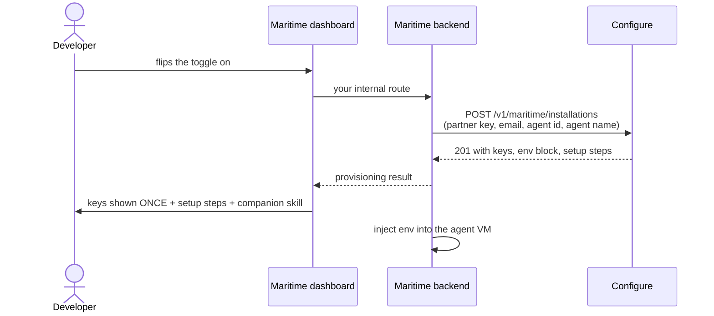

# The Configure toggle for the Maritime dashboard

You are a coding agent working on Maritime's codebase. One toggle provisions a
Configure developer account, agent, and API keys for the logged-in Maritime
developer, and injects them into their agent's environment. Everything you
need is in this file. Build it end to end.

## The whole flow



One synchronous POST. The keys come back in the response to that same call.
Configure never calls Maritime; there are no webhooks and no polling.

## What you build

1. **One backend route** that proxies the toggle to Configure. The partner key
   (`CONFIGURE_PARTNER_KEY`) lives only in Maritime's backend env and is sent
   as `Authorization: Bearer`. It must never reach a browser.
2. **The toggle panel** on the agent page:

   > **Bring personalization to your agent**
   > Powered by Configure. Your agent remembers each user, and what it learns
   > follows them across their AI agents. Flip the toggle and we'll provision
   > your Configure keys automatically.  [toggle]

   Toggle ON: shimmer state ("Provisioning your account..." then, after about
   a second, "Bringing personalization to your agent...", skeleton lines,
   pulsing dot). On success, reveal with a fade-up:
   - the env block (`CONFIGURE_AGENT`, `CONFIGURE_API_KEY`,
     `CONFIGURE_PUBLISHABLE_KEY`) with a Copy .env button and the warning
     "Save your secret key now, it is only shown once."
   - the numbered `setup_steps` from the response (render as steps, linkify
     URLs),
   - buttons: **Claim your Configure profile** (`claim_url`), **View your
     agent's sign-in page** (`sign_in_url`), **Rotate secret key**,
   - the companion-skill handoff (below).

   On page load, render state from the status endpoint: installation exists
   means toggle ON with the secret hidden ("shown when this agent was first
   provisioned"); 404 means toggle OFF. There is no questionnaire in this
   flow; the companion skill figures out what kind of agent it is on its own.
3. **Env injection**: write the `env` block into the agent via Maritime's env
   machinery with `CONFIGURE_API_KEY` marked secret (`is_secret: true`), then
   prompt a restart. On rotation this must happen in the same flow, because
   the old key is already dead when the response arrives.
4. **The companion-skill handoff**: under the steps, a "Set up your agent"
   affordance that gives the developer the `configure-on-maritime` skill to
   paste into their coding agent. That skill owns the agent-side pattern and
   detects solo-vs-product itself; this integration ends at keys plus env.

## The API

Base URL `https://api.configure.dev`, partner key on every call.

### Provision / upsert: `POST /v1/maritime/installations`

```jsonc
{
  "maritime_agent_id": "<stable base agent or project id>",  // required, the idempotency key
  "maritime_user_id": "<Maritime user id>",                  // recommended, for support lookups
  "email": "<developer's email>",                            // required on FIRST provision
  "email_verified": true,                                    // required with email, see rule below
  "agent_name": "<the agent's name in Maritime>",            // Configure derives the handle from it
  "display_name": "<optional display-name override>",
  "agent": "<optional explicit configure handle>",
  "kind": "personal" | "product",                            // optional, only if Maritime happens to know
  "status": "active" | "disabled",                           // optional, toggle-state bookkeeping
  "rotate_api_key": true                                     // optional, existing installations only
}
```

**The `email_verified` rule (hard requirement):** only send `email_verified:
true` when the email comes from the developer's verified Maritime login
session. Never from a free-text input. Configure refuses account work without
it, because a forged email here would mint keys into someone else's Configure
account.

Responses:

- **201** first provision: `agent`, `agent_display_name`, `secret_key`
  (plaintext in this response only; Configure stores it hashed and can never
  re-show it), `publishable_key`, `developer_account_id`, `installation{ id,
  maritime_agent_id, status, claim_status, attached_existing_account, kind }`,
  `sign_in_url`, `claim_url`, `env{...}`, `setup_steps[...]`, and
  `account_existed`. Maritime cannot know in advance whether the email already
  has a Configure account, and does not need to: Configure detects it and
  handles both. `account_existed: false` means a fresh account was created;
  `true` means the new agent and maritime-named keys were added to the
  existing account (never a 409). Same reveal either way; with `true`, label
  the claim button "Open your Configure dashboard".
- **200** repeat call (`created: false`): metadata refreshed, `secret_key`
  null unless `rotate_api_key` was passed (then the new key is in this
  response and the old one is already revoked: re-inject env in the same
  flow). If the call carried a different email than the installation's,
  `email_mismatch: true` comes back and the email was ignored.
- **400** missing `email`/`email_verified` on first provision, or any unknown
  body field (the schema is strict, typos fail loudly). **401** partner key
  missing or wrong. **409** concurrent first-provision race, retry once.
  **503** lane disabled on this Configure deployment.

### Status: `GET /v1/maritime/installations/current?maritime_agent_id=...`

Same auth. 200 with `agent`, `installation`, `sign_in_url`, `claim_url`, and
never keys. 404 means never provisioned: render the toggle OFF.

## When to call (the complete matrix)

The one rule: **provision per base agent or project, never per customer
instance.** `maritime_agent_id` must survive customer scaling. Per-customer
VMs share the base agent's installation and keys.

| Event on Maritime | Call |
|---|---|
| Toggle ON, first time | `POST` with email, `email_verified`, id, name. 201, keys shown once |
| Developer toggles ANOTHER agent | same `POST`, new id, same email. New Configure agent on the same account |
| Rename / settings edit | `POST` with the changed fields. 200 upsert |
| Toggle panel page load | `GET /current` (404 = OFF) |
| Lost key | `POST` `rotate_api_key: true`, then re-inject env and restart in the same flow |
| Toggle OFF or agent deleted | `POST` `status: "disabled"`, stop injecting env. Keys are NOT revoked; back on is `status: "active"` |
| Timeout or 409 race | retry the same `POST`, it is idempotent |
| Developer's email changes later | nothing. A different email on a repeat call is ignored and flagged `email_mismatch: true`; the account stays with the first-provision email, which is also the claim email |
| New customer instance spins up | **no call**. Inject the same env into the instance via your env API (template snapshots blank secret values, so this is Maritime's job on every instance) |
| Agent deleted and re-created (new id) | `POST` as first-time; a fresh Configure agent joins the same account |
| Someone deploys a shared template | their own toggle, their own email; snapshot blanking means keys never leak into copies |

## Copy rules

- Never call it "SSO" or a "sign-in button". Developers get keys; their
  agents mint connect links for end users when needed.
- Claim line: "Claim your Configure profile any time. Log in at
  configure.dev with this same email."
- Error state: "Provisioning failed: <message>. Flip the toggle to retry."

## Acceptance checklist

- [ ] Partner key only ever used server-side.
- [ ] Toggle ON provisions in one POST; shimmer shows both status lines; keys
      reveal once with the save-now warning.
- [ ] Page reload renders ON state from `GET /current`, secret hidden.
- [ ] `email` + `email_verified: true` come from the verified session only.
- [ ] Env injected with `CONFIGURE_API_KEY` as a secret; restart prompted.
- [ ] Rotation revokes, replaces, and re-injects in one flow.
- [ ] Repeat toggles are idempotent (`created: false`, no secret).
- [ ] Toggle OFF sends `status: "disabled"`; back on sends `status: "active"`.
- [ ] The companion skill is handed to the developer under the steps.
